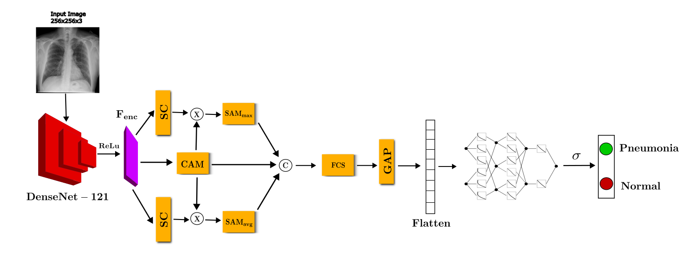
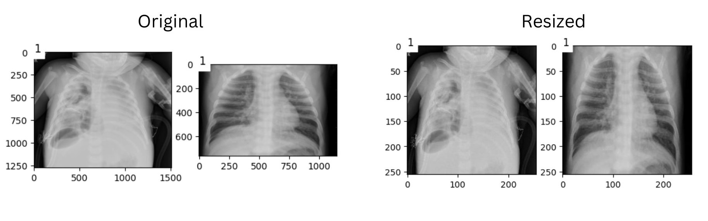
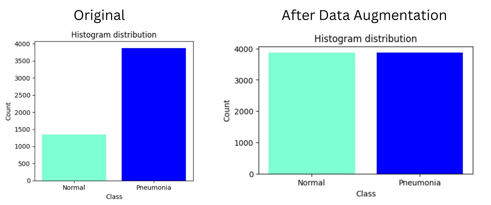
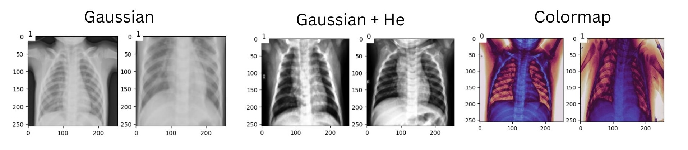
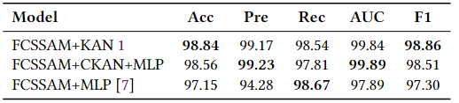
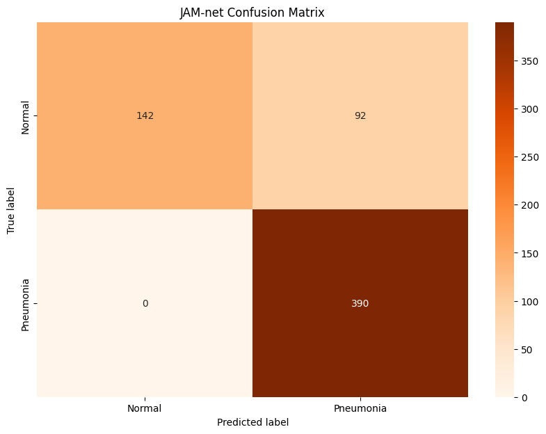
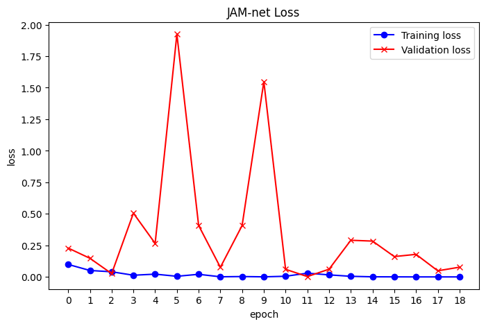
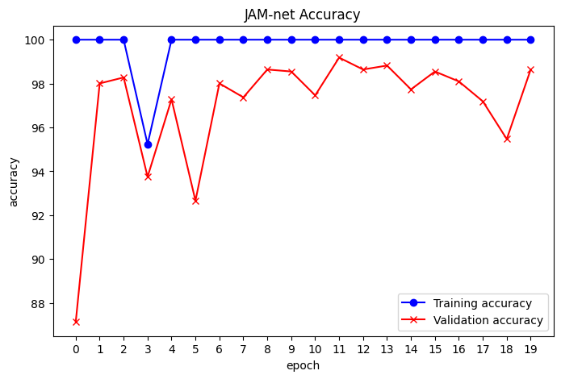

# JAM-net: a KAN-based Deep Neural Network for Pneumonia Detection in Chest X-Rays 

JAM-net (**Jacopo and Massimo Network**) is a deep neural network for pneumonia detection in **Chest X-Rays** [1]. It's based on **FA-net** [2] architecture and on **KAN (Kolmogorov–Arnold Networks)** [3].
In particular, it's composed by the "**Fuzzy Channel Selective Spatial Attention Module**" of the FA-net [2] and the KAN architecture [3] that substitute the MLP layer at the end.


# Installation
1. Clone the repository:  
 ```sh 
 git clone "https://github.com/cybernetic-m/cv-project.git"
 cd cv-project
 ```
# Project Structure 

```sh 
cv-project
├── README.md
├── images
│   ├── Filtering.jpg
│   ├── accuracy.png
│   ├── architecture.png
│   ├── cm.png
│   ├── data_aug.jpg
│   ├── loss.png
│   ├── resizing.jpg
│   └── final_metrics.png
├── models
│   ├── fa_net_best.pt => Trained model on full dataset with best performance on loss
│   ├── jam_net_best.pt => Trained model on full dataset with best performance on loss
│   └── jam_net_last_epoch.pt =>Trained model on full dataset at last epoch
├── notebook
│   ├── FA_ckan.ipynb => Notebook python that implement FA-net training with ckan
│   └── JAM_full.ipynb => Notebook python that implement JAM-net training
└── references
    ├── A_Deep_Feature_Learning_Model .pdf
    ├── KAN- Kolmogorov-Arnold Networks.pdf
    ├── SOTA_chest_ray.pdf
    └── fa_net.pdf
    └── CKAN.pdf
```
    
# Dataset
For the training phase, we have used the [Kermany dataset](https://data.mendeley.com/datasets/rscbjbr9sj/2). It's formed by **5856** chest X-Rays images divided in “**Normal**” and “**Pneumonia**” classes.
The images are of different sized and the dataset is unbalanced, for this reason the code firstly resize the image and after augment the dataset.




# Filtering
As in the literature [1], we have performed a preprocessing operation on images applying **Gaussian**, **Gaussian + Histogram Equalization** filtering and **Colormap** application to the images.


# Results
The training of the network is done with a **batch_size=48**, **early_stopping** monitoring the validation loss with a **threshold = 1e-4** and a **patience = 2**, the optimizer is **AdamW** with a **lr = 0.0001** and finally the loss function is the **Binary Cross Entropy Loss**. The metrics that we measure to validate the model are **Accuracy**, **Precision**, **Recall**, **AUROC** and **F1-Score**. We compare the results with the SOTA model [2] without preprocessing:

**Performances comparison**

<>


**Confusion Matrix**




**Loss Function**




**Accuracy**




# Collaborators
Jacopo Tedeschi (https://github.com/jacopotdsc)


# References
[1]. [Review on chest pathogies detection systems using deep learning techniques](https://link.springer.com/article/10.1007/s10462-023-10457-9#Abs1).

[3]. [KAN: Kolmogorov–Arnold Networks](https://arxiv.org/pdf/2404.19756).

[4]. [Convolutional Kolmogorov-Arnold Networks](https://arxiv.org/pdf/2406.13155)

[7]. [FA-Net: A Fuzzy Attention-aided Deep Neural Network for Pneumonia Detection in Chest X-Rays](https://arxiv.org/pdf/2406.15117).
